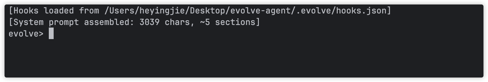

# evolve-agent

<div align="center">
  
</div>

基于 Claude API 的 Python AI 编程助手，支持钩子系统、持久化记忆、权限控制、上下文压缩。

## 待办清单
- [ ] 终端样式调整（替换为typer）
- [ ] 替换 evolve agent 子命令启动本地Agent
- [ ] 支持 channel gateway 能力（优先级低）
- [ ] 持久化 Session 能力
- [ ] trace 追踪调用流程能力
- [ ] token 用量追踪
- [ ] 支持以知识仓库为核心的迭代模式（以md格式存储在统一Github仓库）
  - [ ] 提供内置Skill /import-wiki :拉取知识仓库到本地项目
  - [ ] 提供内置Skill /spec :提取知识仓库信息做内部规划
  - [ ] 提供内置Skill /apply-spec :执行规划
  - [ ] 提供内置Skill /extra-wiki :提取当前 Session Summary，自动PR至知识仓库 （知识库作者审核合并入库）
- [ ] evolve wiki 子命令维护知识仓库
  - [ ] 知识成熟度晋升、衰退
  - [ ] 知识提交日志维护


## 核心特性

### 钩子系统
通过 PreToolUse、PostToolUse、SessionStart 钩子自定义 Agent 行为。

```json
{
  "trust": true,
  "hooks": {
    "PreToolUse": [
      {
        "matcher": "Bash",
        "command": "node scripts/check_safety.js"
      }
    ],
    "PostToolUse": [
      {
        "matcher": "Write",
        "command": "git add ."
      }
    ]
  }
}
```

配置文件路径：`.evolve/settings.json`。

### 持久化记忆
跨会话持久化的记忆系统，支持四种类型：
- `user` — 用户偏好
- `feedback` — 过往纠正的问题
- `project` — 非显而易见的项目约定
- `reference` — 外部资源指向（任务面板、监控面板、文档）

### 权限控制
细粒度的工具调用权限管理，控制哪些工具可以使用以及使用条件。

### 上下文压缩
`compact` 工具智能压缩对话上下文，保持在模型限制内。

### 技能系统
可扩展的技能框架，内置技能包括：
- `commit` — git commit/push/pr 工作流

## 快速开始

### 安装依赖

```shell
uv sync
```

### 配置环境变量

```shell
export API_KEY="sk-ant-..."
export MODEL="claude-sonnet-4-20250514"
```

或创建 `.env` 文件（参考 `.env.example`）。

### 运行

```shell
uv run evolve agent
```

或直接：

```shell
python -m evolve
```

启动后进入交互式界面：



## 项目结构

```
evolve-agent/
├── evolve/
│   ├── agents/         # 子 Agent 与任务执行
│   ├── cli/            # Typer CLI 入口与子命令
│   ├── config.py       # 配置对象
│   ├── hooks.py        # HookManager
│   ├── permission/     # 权限管理
│   ├── prompt.py       # 系统提示词构建
│   ├── runtime.py      # Evolve 运行时
│   ├── tools/          # 工具实现
│   ├── skills/         # 技能定义
│   │   └── commit/
│   └── shared/         # 共享工具与基础方法
├── tests/              # 测试套件
├── .evolve/            # 运行时数据
│   ├── sessions/       # 会话持久化
│   ├── background-tasks/
│   ├── compact/
│   ├── memory/
│   └── settings.json   # trust / hooks 等配置
└── AGENT.md            # Agent 指令
```

## 开发者指南

### 安装依赖

```shell
uv sync
```

### 代码检查

```shell
ruff check . --fix
```

### 运行测试

```shell
uv run pytest
```

### 项目依赖

- `anthropic>=0.97.0` — Claude API 客户端
- `python-dotenv>=1.2.2` — 环境变量加载

## License

参见 [LICENSE](LICENSE) 文件。
